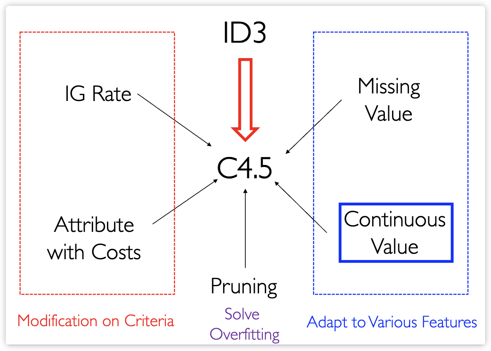

## 一、 决策树基础

### 1. 核心动机与直觉

- **特征异质性处理**：决策树旨在处理具有离散值、不同量纲以及高度异质性特征的数据集。
- **模型可解释性**：与线性模型相比，决策树能够提供更直观的解释。例如，解释一个水果为何是柠檬时，可以直观地表述为“因为它既是圆的又是酸的”。
- **模拟人类决策**：决策树模拟了人类通过寻找最有用特征（如形状、味道）并逐步细分数据集的分类逻辑。

### 2. 决策树的结构定义

一个完整的决策树由以下部分组成：

- **内部节点 (Internal Node)**：每个内部节点表示对一个属性（Attribute）的测试。
- **分支 (Branch)**：每个分支对应一个属性值的测试结果。
- **叶节点 (Leaf Node)**：每个叶节点分配一个最终的分类标签。

### 3. 节点分裂与测量 (Node Splitting)

- **分裂目标**：我们希望叶节点尽可能“纯”，即尽可能接近单一类别，从而降低分类误差。
- **分类误差定义**：分类误差通常定义为 $\min(p, 1-p)$。
- **分裂选择**：算法会选择能够最大程度降低“不纯度”度量（Impurity measure）的特征进行分裂。

#### 1) 三种标准节点不纯度度量方式

对于两类分类问题（设 $p$ 为类别 1 的比例），常用的度量函数如下：

| 度量方式 | 公式内容 | 适用算法 |
| :--- | :--- | :--- |
| **误分类率 (Misclassification error)** | $Err(R) = 1 - \max_k(p_k)$ | 常用于评估 |
| **熵 (Entropy)** | $H(R) = -\sum_{k=1}^K p_k \log p_k$ | ID3, C4.5 |
| **基尼指数 (Gini index)** | $Gini(R) = 1 - \sum_{k=1}^K p_k^2$ | CART |

- **数值特性**：当 $p=0.5$ 时（完全混合），不纯度达到最大值；当 $p=0$ 或 $p=1$ 时（完全纯净），不纯度为 0。

### 4. 决策树的假设空间 (Hypothesis Space)

- **几何特征**：决策树将特征空间划分为一个个**轴平行（Axis-parallel）**的矩形区域。
- **区域标记**：每个矩形区域都被赋予一个特定的标签。
- **非参数特性**：这是一种非参数化方法，能够拟合复杂的非线性决策边界，但也容易导致过拟合。

### 5. 决策树的优缺点总结

#### 1) 主要优点

- **易于解释**：甚至比线性回归更容易向非专家解释。
- **处理多种数据类型**：能够自然处理定性（类别）预测变量，无需创建虚拟变量。
- **非度量方法 (Non-metric)**：对特征的尺度（Scale）不敏感，不需要像 SVM 或 KNN 那样进行特征缩放。
- **鲁棒性**：能够自然地处理缺失值和噪声数据。

#### 2) 主要缺点

- **不稳定**：小规模数据的变动可能导致树结构的剧烈变化。
- **非连续性**：预测函数是不连续的，在回归任务中可能不如其他方法平滑。
- **维数灾难**：在处理极高维空间时可能面临挑战。

---

## 二、 决策树 （Decision Tree）

### 1. ID3 算法 (ID3 Algorithm)

ID3（Interactive Dichotomizer 3）是由 Ross Quinlan 开发的决策树基础算法。

#### 1) 核心准则：信息增益 (Information Gain, IG)

- **基本原理**：在选择分裂属性时，ID3 追求的是分裂后不纯度（熵）下降最快的特征。
- **计算公式**：

    $$
    IG(D, A) = H(D) - \sum_{v \in Values(A)} \frac{|D_v|}{|D|} H(D_v)
    $$

    其中 $H(D)$ 是父节点的熵，后半部分是各子节点熵的加权平均。
- **意义**：在信息论中，熵代表编码随机变量所需的平均比特数；熵越大，信息越乱。IG 越大，代表该特征提供的分类信息越多。

#### 2) 算法流程

1. **开始**：创建根节点，将所有样本分配至根节点。
2. **主循环**：
    - 计算所有特征的 IG，选择 IG 最大的特征 $A$ 作为当前节点的决策属性。
    - 为特征 $A$ 的每个可能取值创建一个分支，并将样本划分到相应的子节点中。
3. **停止条件**：如果样本已完全分类，则停止；否则，对新的子节点递归执行主循环。

#### 3) ID3 的局限性

- **多值偏好**：信息增益对取值较多（Multivalued）的特征有严重偏好。例如，若将“日期”或“主键 ID”作为特征，其 IG 会非常高（因为每个分支只含一个样本，熵为 0），但这类特征对预测新样本毫无用处。

### 2. C4.5 算法 (C4.5 Algorithm)

C4.5 是对 ID3 的全面改进，它解决了 ID3 的多值偏好问题，并增强了对不同数据类型的适应性。

#### 1) 选择标准的改进

为了解决 ID3 的多值偏好并考虑现实成本，C4.5 引入了以下两个改进标准：

1. **增益率 (Gain Ratio, GR)**
    为了抵消 ID3 对多值属性的偏好，C4.5 引入了**增益率**。
    - **固有值 (Intrinsic Value, IV)**：衡量属性 $Z$ 值的分布熵，对多值属性起到惩罚作用。

        $$
        IV(Z) = -\sum_{i=1}^n \frac{|D_i|}{|D|} \log \frac{|D_i|}{|D|}
        $$

    - **增益率计算**：属性的选择标准变为信息增益与固有值的比值。

        $$
        GR = \frac{Information Gain}{Intrinsic Value}
        $$

2. **处理不同代价的属性 (Attributes with Costs)**
    - **引入成本**：在某些应用中（如医疗诊断），获取某些属性（如 MRI）的成本可能很高。C4.5 允许引入成本（Cost）项。
    - **新准则**：旨在平衡预测能力与获取属性的代价，通常定义为：$(\text{Gain Ratio})^2 / \text{Cost}$。

#### 2) 特征适应性处理 (Feature Adaptability)

1. **连续值处理 (Continuous Variables)**
    - 将连续属性离散化，通过阈值 $e$ 划分为 $\le e$ 和 $> e$ 两个区间。
    - **分裂点寻找**：遍历排序后的特征值，取相邻值的**中点**作为候选分裂点，选择使信息增益（IG）最高的点进行分裂。

2. **缺失值处理 (Missing Values)**
    - **训练时**：在计算 IG 时，仅使用属性值已知的样本进行计算，并乘以一个权重 $(1-a)$（其中 $a$ 是缺失样本的比例）进行降权。同时，将缺失该属性值的样本以**权重**形式分配到所有子节点中。
    - **测试时**：通常用该属性最常见的取值来补充缺失值。

#### 3) 解决过拟合：剪枝策略 (Pruning)

1. **预剪枝 (Pre-Pruning)**：在训练过程中，若某个分裂不能带来验证集准确率的显著提升（或甚至下降），则提前停止生长。缺点是可能导致**欠拟合**。
2. **后剪枝 (Post-Pruning)**：让树充分生长后，自底向上修剪那些无法提升验证准确率的子树。这通常能获得更好的泛化性能。
3. **代价复杂度正则化**：引入参数 $\gamma$ 权衡树的经验错误和复杂度（叶节点数量 $|k|$）：

    $$
    C_\gamma(k) = \sum_{q=1}^{|k|} N_q H_q(k) + \gamma |k|
    $$

    该方法通过最小化正则化后的代价来选择最优的剪枝子树。

### 3. CART (Classification and Regression Tree)

CART 算法是 Breiman 等人于 1984 年提出的，其核心特点是：

- **二叉树结构**：无论是分类还是回归任务，CART 总是生成**二叉树**，即每个非叶节点仅分裂为两个分支。
- **统一框架**：它提供了一个统一的框架，能够处理分类（Classification）和回归（Regression）两类问题。
- **后剪枝**：CART 同样使用后剪枝（代价复杂度剪枝）来对抗过拟合。

#### 1) 分类树：基尼指数 (Gini Index)

CART 在构建分类树时，使用**基尼指数 (Gini Index)** 来衡量节点的不纯度，并取代了 C4.5 中使用的熵和信息增益。

- **基尼指数定义**：衡量从数据集中随机抽取两个样本，其类别标记不一致的概率。基尼指数越小，数据集的纯度越高。

    $$
    Gini(D) = 1 - \sum_{k=1}^K p_k^2
    $$

- **节点分裂准则**：对于给定特征 $A$，CART 遍历其所有可能的取值，寻找能最小化分裂后**加权平均基尼指数**的特征 $A$ 及其分裂点。

    $$
    Gini(D, A) = \frac{|D_1|}{|D|} Gini(D_1) + \frac{|D_2|}{|D|} Gini(D_2)
    $$

    其中 $D_1$ 和 $D_2$ 是分裂后的两个子集。

#### 2) 回归树 (Regression Tree)

CART 是第一个广泛应用的回归决策树算法。

- **叶节点预测值**：对于一个被划分到叶节点 $R_j$ 的样本，其预测值 $\hat{y}$ 通常被定义为该区域内所有训练样本目标值的**平均值**。

    $$
    \hat{y}_{R_j} = \text{Average}(y_i \mid x_i \in R_j)
    $$

- **分裂标准：最小化平方误差和 (L2 Loss)**：
    在寻找最佳分裂点时，回归树旨在最小化分裂后两个子区域内的**平方误差之和**（或称方差）。
- **计算目标**：选择特征 $W$ 和分裂点 $e$，最小化：

    $$
    \ell(W, e) = \sum_{x_i \in R_1(W,e)} (y_i - \hat{y}_{R1})^2 + \sum_{x_i \in R_2(W,e)} (y_i - \hat{y}_{R2})^2
    $$

    其中 $\hat{y}_{R1}$ 和 $\hat{y}_{R2}$ 分别是区域 $R_1$ 和 $R_2$ 内样本的平均响应值。

### 4. 泛化界 (Generalization Bound)

泛化界是衡量模型泛化能力（即在测试集上的表现）的理论工具。由于决策树具有非参数和轴平行划分的特性，其假设空间的复杂度非常高，需要理论工具来界定其泛化误差。

#### 1) VC 维界 (VC-Dimension Bound)

VC 维（Vapnik-Chervonenkis Dimension）是衡量假设空间 $\mathcal{H}$ 复杂度的重要指标。

- **VC 维定理**：对于一个取值为 $\{-1, +1\}$ 的函数族 $\mathcal{H}$ 且其 VC 维为 $d$，则对于任意 $\delta > 0$，以至少 $1-\delta$ 的概率，对于所有 $h \in \mathcal{H}$，其泛化误差 $\mathcal{E}_{out}(h)$ 存在上界：

    $$
    \mathcal{E}_{D}(h) \le \hat{\mathcal{E}}_{D_n}(h) + \sqrt{\frac{d \log \frac{2en}{d}}{n}} + \sqrt{\frac{\log \frac{1}{\delta}}{2n}}
    $$

    其中 $n$ 是训练样本数，$\hat{\mathcal{E}}_{D_n}(h)$ 是经验误差（训练误差）。

- **决策树的 VC 维**：
  - 决策树的**分裂规则**是对特征值进行阈值分割 $u_i \le e_i$。
  - 一个具有 $k$ 个叶节点（区域）的决策树可以**打散（shatter）**一个包含 $k$ 个实例的集合。
  - 因此，决策树的 VC 维可以近似为叶节点的数量 $k \approx 2^d$。
  - 由于 $p$ 可以随样本数量增长而变得非常大，决策树的 VC 维很高，导致它是**非参数**模型，很容易导致**过拟合**。

#### 2) 最小描述长度界 (Minimum Description Length Bound, MDL)

MDL 原理认为，最好的模型是能够用最短编码来描述数据和模型本身的假设。

- **MDL 定理**：令 $\mathcal{H}$ 是一个假设空间，且 $\hat{L}: \mathcal{H} \mapsto \{0, 1\}^*$ 是一个针对 $\mathcal{H}$ 的**前缀无关描述语言**（prefix-free description language）。用 $|h|$ 表示描述 $h$ 的长度 $\hat{L}(h)$。则以至少 $1-\delta$ 的概率，对于所有 $h \in \mathcal{H}$：

    $$
    \mathcal{E}_{D}(h) \le \hat{\mathcal{E}}_{D_n}(h) + \sqrt{\frac{|h| + \log \frac{2}{\delta}}{2n}}
    $$

- **意义**：该定理表明，泛化误差由两部分组成：训练误差  $\hat{\mathcal{E}}_{D_n}$ 和模型复杂度（由 $|h|$ 衡量）。
- **正则化联系**：这为**剪枝**（Pruning）策略提供了理论基础：通过限制树的深度和叶节点数量（即减小 $|h|$），可以在训练误差和模型复杂度之间找到一个平衡点，从而实现更好的泛化性能。

---

## 三、 随机森林 (Random Forest)

决策树虽然解释性强，但其**方差高**（对训练数据的微小变动敏感）且容易过拟合。随机森林通过**集成学习 (Ensemble Learning)** 的方式，有效地解决了决策树的这些问题。

### 1. 集成学习基础：Bagging (Bootstrap Aggregation)

随机森林基于 Bagging 思想。Bagging 是一种**并行**的集成方法。

#### 1) Bootstrap 抽样

- **方法**：从原始训练集 $D$ 中**有放回地**抽取 $m$ 个样本，生成 $B$ 个新的训练集 $D_1, D_2, \dots, D_B$。
- **样本比例**：在 $B$ 个样本集 $D_b$ 中，平均有约 $63.2\%$ 的原始样本被选中，剩余 $36.8\%$ 的样本（称为 **OOB 样本**）未被选中。

    $$
    P(\text{unselected}) = (1 - \frac{1}{m})^m \approx e^{-1} \approx 0.368
    $$

#### 2) 集成与聚合

- **训练**：在每个 $D_b$ 上独立训练一个基学习器 $h_b$（这里是决策树）。
- **预测**：
  - **分类任务**：使用**多数投票** (Majority Voting) 来聚合所有基学习器的结果。
  - **回归任务**：使用**平均值** (Averaging) 来聚合所有基学习器的结果。

#### 3) Bagging 的效果

Bagging 的核心目标是**降低方差**。由于每个基学习器是在不同子集上训练的，它们的预测误差是去相关的（或弱相关的）。对这些去相关的预测取平均（或投票）能显著平滑预测结果，从而降低总方差，同时保持低偏差。

### 2. Breiman 随机森林算法 (Breiman Algorithm)

随机森林（Random Forest, RF）在 Bagging 的基础上进一步引入了**特征随机性**（随机特征子空间）来增强树之间的独立性。

#### 1) 算法流程

1. **输入**：训练集 $D$，特征总数 $d$，要构建的树的数量 $B$。
2. **循环**：对 $b = 1$ 到 $B$：
    - **Bootstrap 采样**：从 $D$ 中有放回地抽取一个训练集 $D_b$。
    - **构建树** $T_b$：在 $D_b$ 上构建一棵决策树。
        - **关键步骤：特征随机化**：在每个节点分裂时，**随机选择 $m$ 个特征** ($m < d$) 作为候选特征子集。
        - **分裂选择**：仅从这 $m$ 个候选特征中选择最佳的分裂特征和分裂点。
    - **完全生长**：树 $T_b$ 通常被允许完全生长（不进行剪枝）。
3. **输出**：集成模型 $\{T_b\}_{b=1}^B$。
4. **预测**：使用多数投票（分类）或平均值（回归）进行集成预测。

#### 2) 特征随机化的作用

- **去相关性 (De-correlation)**：如果数据中存在少数几个**强预测性**的特征，那么在 Bagging 的每棵树中，这些特征都会被选为根节点或顶级节点。这将导致所有树的结构高度相似，相关性强。
- **随机森林的优势**：随机选择特征子集，确保即使存在强特征，不同的树也会被迫基于不同的特征集进行分裂，**降低了树之间的相关性**，从而最大化了 Bagging 降低方差的效果。
- **参数 $m$ 的选择**：通常 $m$ 的经验值取 $\sqrt{d}$（分类任务）或 $d/3$（回归任务）。

### 3. 袋外错误率 (Out-of-Bag Error)

随机森林提供了一种**内部验证机制**，无需额外的交叉验证或独立的验证集。

- **OOB 数据**：对于构建的每棵树 $T_b$，约 $36.8\%$ 的训练样本未参与其训练，这些样本称为 OOB 样本。
- **OOB 误差估计**：对于训练集中的每个样本 $x_i$，只使用未将其包含在 Bootstrap 样本中的树集合 $\mathcal{T}_{\text{OOB}}(x_i)$ 进行预测。
  - **优势**：OOB 估计的误差率与使用独立验证集得到的误差率非常相似，提供了有效的无偏性能估计。

### 4. 偏差-方差分解 (Bias-Variance Decomposition)

- **单棵决策树**：通常具有**低偏差**（因为模型具有足够的复杂度来拟合训练数据）和**高方差**（对训练数据敏感）。
- **随机森林**：
  - **偏差 (Bias)**：通过允许每棵树完全生长（不剪枝），RF 的偏差仍然保持较低。
  - **方差 (Variance)**：通过 Bagging（样本随机）和特征随机化（特征随机），显著降低了集成模型的方差。
- **结论**：随机森林通过集成，有效地保留了决策树的**低偏差**优势，同时解决了其**高方差**的缺点。

---
