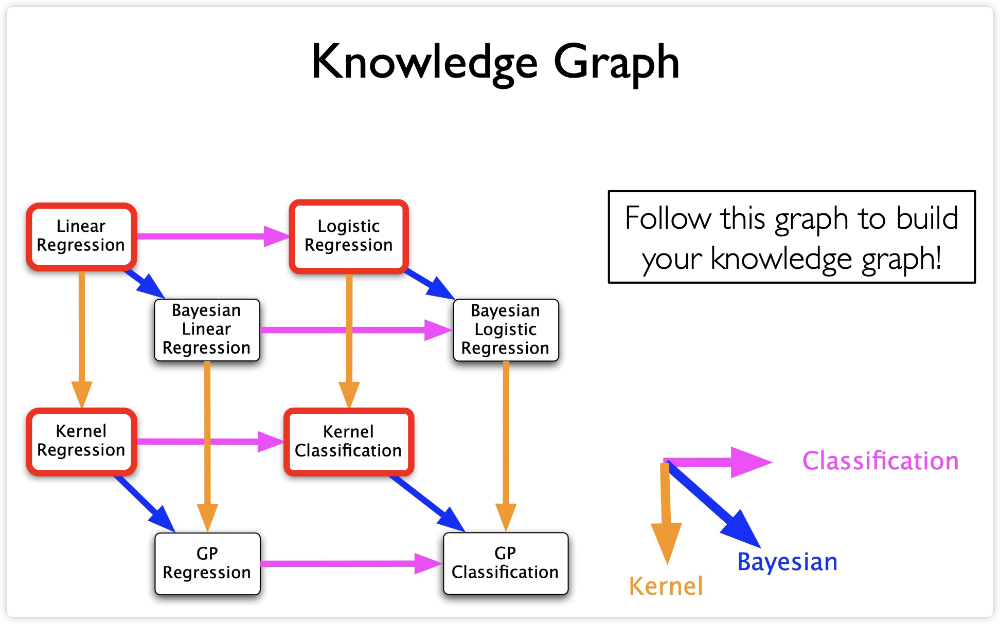

---

## 一、引言：为什么需要SVM？

### 1. 线性分类器的困境

- 对于线性可分数据，存在无穷多个分离超平面。
- 朴素选择（如感知机）不考虑**泛化能力**。
- 直观目标：选择**最鲁棒**（对噪声容忍度最高）的分类器。

### 2. 最大间隔思想（Maximum Margin）

- **间隔（Margin）**：分类超平面到最近样本点的距离的两倍。
- **支持向量（Support Vectors）**：落在间隔边界上的样本点。
- **核心直觉**：
  - 间隔越大，分类器对噪声越鲁棒；
  - 间隔最大的分类器具有最佳泛化性能。

---

## 二、硬间隔SVM（Hard-Margin SVM）

### 1. 问题建模

- **目标**：最大化间隔  
  $$\max_{\mathbf{w}, b} \frac{2}{\|\mathbf{w}\|}$$
- **约束**：所有样本被正确分类  
  $$y_i(\mathbf{w}^\top \mathbf{x}_i + b) \geq 1,\quad \forall i = 1,\dots,n$$

### 2. 等价凸优化问题

- 将最大化间隔转化为最小化 $\|\mathbf{w}\|^2$（便于求解）：
  $$
  \begin{aligned}
    \min_{\mathbf{w}, b}\ & \frac{1}{2} \|\mathbf{w}\|^2 \\
    \text{s.t. }\ & y_i(\mathbf{w}^\top \mathbf{x}_i + b) \geq 1,\quad \forall i
  \end{aligned}
  $$
- 此为**凸二次规划问题**（Convex QP），但仅适用于**线性可分**情形。

> **注意**：硬间隔SVM在实际中几乎不用，因为现实数据通常含噪声或不可分。

---

## 三、软间隔SVM（Soft-Margin SVM）

### 1. 引入松弛变量（Slack Variables）

- 允许部分样本违反间隔约束，引入松弛变量 $\xi_i \geq 0$：
  $$
  y_i(\mathbf{w}^\top \mathbf{x}_i + b) \geq 1 - \xi_i,\quad \xi_i \geq 0
  $$
- $\xi_i$ 的含义：
  - $\xi_i = 0$：样本在正确一侧且在间隔外；
  - $0 < \xi_i < 1$：样本在间隔内但分类正确；
  - $\xi_i > 1$：样本被错误分类。

### 2. 优化目标

- 在最大化间隔与最小化误分类之间权衡：
  $$
  \begin{aligned}
    \min_{\mathbf{w}, b, \boldsymbol{\xi}} \frac{1}{2} \|\mathbf{w}\|^2 + C \sum_{i=1}^n \xi_i \\
    \text{s.t. } y_i(\mathbf{w}^\top \mathbf{x}_i + b) \geq 1 - \xi_i,\quad \xi_i \geq 0
  \end{aligned}
  $$
- 超参数 $C > 0$ 控制**间隔大小**与**分类误差**的权衡：
  - $C$ 大 → 强惩罚误分类 → 小间隔、低偏差、高方差；
  - $C$ 小 → 容忍更多误分类 → 大间隔、高偏差、低方差。

---

## 四、约束优化基础（Constrained Optimization）

支持向量机的求解本质上是一个**带不等式约束的凸优化问题**。为理解SVM的对偶形式与KKT条件，需掌握约束优化的基本工具。

### 1. 凸优化问题（Convex Optimization）

- 一个优化问题  
  $$
  \min_{\mathbf{x}} f(\mathbf{x}) \quad \text{s.t. } \mathbf{x} \in \mathcal{C}
  $$  
  称为**凸优化问题**，若：
  - 目标函数 $f$ 是**凸函数**；
  - 可行域 $\mathcal{C}$ 是**凸集**。
- **凸函数定义**：对任意 $\theta \in [0,1]$，有  
  $$
  f(\theta \mathbf{x} + (1-\theta)\mathbf{y}) \leq \theta f(\mathbf{x}) + (1-\theta) f(\mathbf{y})
  $$
- SVM的目标函数 $\frac{1}{2}\|\mathbf{w}\|^2$ 是严格凸的，约束为线性不等式，因此是**凸二次规划（Convex QP）**，具有全局唯一最优解。

### 2. 等式约束：拉格朗日乘子法（Lagrange Multipliers）

- 考虑问题：  
  $$
  \min_{\mathbf{x}} f(\mathbf{x}) \quad \text{s.t. } h(\mathbf{x}) = 0
  $$
- 在最优解 $\mathbf{x}^*$ 处，目标函数梯度 $\nabla f(\mathbf{x}^*)$ 与约束曲面法向量 $\nabla h(\mathbf{x}^*)$ **共线**（否则可沿约束曲面下降）。
- 引入**拉格朗日乘子** $\lambda$，构造**拉格朗日函数**：  
  $$
  \mathcal{L}(\mathbf{x}, \lambda) = f(\mathbf{x}) + \lambda h(\mathbf{x})
  $$
- 最优解满足：  
  $$
  \nabla_{\mathbf{x}} \mathcal{L} = 0, \quad \frac{\partial \mathcal{L}}{\partial \lambda} = h(\mathbf{x}) = 0
  $$

### 3. 不等式约束：KKT条件（Karush–Kuhn–Tucker Conditions）

- 考虑一般约束优化问题（**原问题**）：  
  $$
  \begin{aligned}
    \min_{\mathbf{x}} &\quad f(\mathbf{x}) \\
    \text{s.t. } &\quad g_i(\mathbf{x}) \leq 0,\quad i=1,\dots,m \\
                 &\quad h_j(\mathbf{x}) = 0,\quad j=1,\dots,p
  \end{aligned}
  $$
- 引入拉格朗日乘子 $\boldsymbol{\alpha} \geq 0$（对应不等式）和 $\boldsymbol{\lambda}$（对应等式），构造拉格朗日函数：  
  $$
  \mathcal{L}(\mathbf{x}, \boldsymbol{\alpha}, \boldsymbol{\lambda}) = f(\mathbf{x}) + \sum_{i=1}^m \alpha_i g_i(\mathbf{x}) + \sum_{j=1}^p \lambda_j h_j(\mathbf{x})
  $$
- 若问题为**凸优化**且满足约束规范（如线性约束），则 $\mathbf{x}^*$ 为最优解 **当且仅当** 存在 $\boldsymbol{\alpha}^*, \boldsymbol{\lambda}^*$ 满足 **KKT条件**：
  1. **原始可行性（Primal Feasibility）**：  
     $g_i(\mathbf{x}^*) \leq 0,\ h_j(\mathbf{x}^*) = 0$
  2. **对偶可行性（Dual Feasibility）**：  
     $\alpha_i^* \geq 0$
  3. **互补松弛性（Complementary Slackness）**：  
     $\alpha_i^* g_i(\mathbf{x}^*) = 0$
  4. **驻点条件（Stationarity）**：  
     $\nabla f(\mathbf{x}^*) + \sum_i \alpha_i^* \nabla g_i(\mathbf{x}^*) + \sum_j \lambda_j^* \nabla h_j(\mathbf{x}^*) = 0$

> 互补松弛性意味着——若约束未激活（$g_i(\mathbf{x}^*) < 0$），则对应乘子 $\alpha_i^* = 0$；反之，若 $\alpha_i^* > 0$，则约束必在边界上（$g_i(\mathbf{x}^*) = 0$）。这正是**支持向量**的数学来源。

### 4. 对偶问题（Dual Problem）与强对偶性

- **原问题**（Primal）：$\min_{\mathbf{x}} \max_{\boldsymbol{\alpha} \geq 0, \boldsymbol{\lambda}} \mathcal{L}(\mathbf{x}, \boldsymbol{\alpha}, \boldsymbol{\lambda})$
- **对偶问题**（Dual）：$\max_{\boldsymbol{\alpha} \geq 0, \boldsymbol{\lambda}} \min_{\mathbf{x}} \mathcal{L}(\mathbf{x}, \boldsymbol{\alpha}, \boldsymbol{\lambda})$
- **弱对偶性**：对偶最优值 ≤ 原问题最优值。
- **强对偶性**：若原问题为凸且满足约束规范，则**对偶间隙为零**，即两者最优值相等。此时可通过求解对偶问题得到原问题解。

---

## 五、SVM的对偶问题（Dual Problem）

### 1. 拉格朗日函数

- 引入拉格朗日乘子 $\alpha_i \geq 0$（对应主约束）和 $\mu_i \geq 0$（对应 $\xi_i \geq 0$）：
  $$
  \mathcal{L} = \frac{1}{2}\|\mathbf{w}\|^2 + C\sum_i \xi_i - \sum_i \alpha_i [y_i(\mathbf{w}^\top \mathbf{x}_i + b) - 1 + \xi_i] - \sum_i \mu_i \xi_i
  $$

### 2. KKT条件与对偶形式

- 对 $\mathbf{w}, b, \xi_i$ 求偏导并令为0，得：
  $$
  \mathbf{w} = \sum_{i=1}^n \alpha_i y_i \mathbf{x}_i,\quad \sum_{i=1}^n \alpha_i y_i = 0,\quad \alpha_i = C - \mu_i \leq C
  $$
- 代入后得到**对偶问题**：
  $$
  \begin{aligned}
  \max_{\boldsymbol{\alpha}} \sum_{i=1}^n \alpha_i - \frac{1}{2} \sum_{i=1}^n \sum_{j=1}^n \alpha_i \alpha_j y_i y_j \mathbf{x}_i^\top \mathbf{x}_j \\
  \text{s.t. } \sum_{i=1}^n \alpha_i y_i = 0,\quad 0 \leq \alpha_i \leq C
  \end{aligned}
  $$

### 3. 支持向量与稀疏性

- **KKT互补松弛条件**：$\alpha_i [y_i(\mathbf{w}^\top \mathbf{x}_i + b) - 1 + \xi_i] = 0$
- 因此：
  - 若 $\alpha_i > 0$，则样本 $i$ 是**支持向量**；
  - 决策函数仅依赖支持向量：
    $$
    f(\mathbf{x}) = \text{sign}\left( \sum_{i:\alpha_i>0} \alpha_i y_i \mathbf{x}_i^\top \mathbf{x} + b \right)
    $$
- 解具有**稀疏性**：多数 $\alpha_i = 0$。

> 对偶问题的优势在于——
>
> - 将约束“吸收”进目标函数；  
> - 自然引入核技巧（仅需内积 $\mathbf{x}_i^\top \mathbf{x}_j$）；  
> - 解具有稀疏性（多数 $\alpha_i = 0$）。

### 4. 求解算法

- **序列最小优化（SMO）**：高效求解对偶QP问题；
- **核技巧兼容**：对偶形式天然支持核函数。

---

## 六、SVM的原始问题求解：随机梯度下降（SGD）

传统SVM通过求解对偶问题（QP）获得解，但其计算复杂度为 $O(n^{2\sim3})$，难以扩展至大规模数据。

### 1. 软间隔SVM的原始问题形式

软间隔SVM的约束优化形式为：
$$
\begin{aligned}
\min_{\mathbf{w}, b, \boldsymbol{\xi}} &\quad \frac{1}{2} \|\mathbf{w}\|^2 + C \sum_{i=1}^n \xi_i \\
\text{s.t. } &\quad y_i(\mathbf{w}^\top \mathbf{x}_i + b) \geq 1 - \xi_i, \quad \xi_i \geq 0, \quad \forall i
\end{aligned}
$$

### 2. 等价正则化风险最小化问题

**关键定理**：上述约束优化问题**等价于**无约束的正则化风险最小化问题：
$$
\min_{\mathbf{w}, b} \frac{1}{2} \|\mathbf{w}\|^2 + \frac{C}{n} \sum_{i=1}^n \max\left(0, 1 - y_i(\mathbf{w}^\top \mathbf{x}_i + b)\right)
$$
其中 $\ell(z) = \max(0, 1 - z)$ 称为**合页损失（Hinge Loss）**。

### 3. 合页损失的性质

- **非光滑**：在 $z=1$ 处不可导，需使用**次梯度（subgradient）**。
- **对异常值鲁棒性**：  
  - Hinge loss 对严重误分类样本（$z \ll 0$）的梯度恒定（不像指数损失或平方损失那样随误差增大而爆炸）；
  - 因此比指数损失（如AdaBoost）更鲁棒，但不如0/1损失（不可优化）。

| 损失函数 | 表达式 | 对异常值敏感度 |
|----------|--------|----------------|
| 0/1损失 | $\mathbb{I}[z \leq 0]$ | 最低（但不可优化） |
| 合页损失 | $\max(0, 1 - z)$ | 中等 |
| Logistic损失 | $\log(1 + e^{-z})$ | 较高 |
| 指数损失 | $e^{-z}$ | 最高 |

### 4. SGD算法细节

由于目标函数是**凸但非光滑**的，使用**次梯度下降**。

- **单样本SGD更新**（每次采样一个样本 $i$）：
  - 若 $y_i(\mathbf{w}^\top \mathbf{x}_i + b) \geq 1$（无损失）：
    $$
    \nabla_{\mathbf{w}} = \mathbf{w}
    $$
  - 否则（有损失）：
    $$
    \nabla_{\mathbf{w}} = \mathbf{w} - C y_i \mathbf{x}_i
    $$
- **更新规则**（忽略偏置 $b$ 的更新，或将其吸收到 $\mathbf{w}$ 中）：
  $$
  \mathbf{w} \leftarrow \mathbf{w} - \eta \left( \mathbf{w} - C y_i \mathbf{x}_i \cdot \mathbb{I}[y_i f(\mathbf{x}_i) < 1] \right)
  $$
- **实际实现技巧**：
  - 引入累积变量 $\mathbf{a}_t$，令 $\mathbf{w}_t = t \mathbf{a}_t$；
  - 更新规则简化为：
    $$
    \mathbf{a}_{t+1} =
    \begin{cases}
    \mathbf{a}_t + \frac{C}{t} y_i \mathbf{x}_i & \text{if } y_i f(\mathbf{x}_i) < 1 \\
    \mathbf{a}_t & \text{otherwise}
    \end{cases}
    $$
  - 最终输出为**平均解**（Polyak-Ruppert averaging）：
    $$
    \bar{\mathbf{w}} = \frac{1}{T} \sum_{t=1}^T \mathbf{w}_t
    $$
- **收敛性**：
  - 对凸函数：收敛速率 $O(1/\sqrt{T})$；
  - 对强凸函数（如带 $\ell_2$ 正则）：收敛速率 $O(\log T / T)$。

### 5. 支持向量回归（Support Vector Regression, SVR）

SVM思想可自然推广至回归任务，称为**支持向量回归（SVR）**。

- **核心思想**：引入 **$\epsilon$-不敏感损失（$\epsilon$-insensitive loss）**，即对预测值与真实值之差小于 $\epsilon$ 的样本不施加惩罚。
- **损失函数**：
  $$
  \ell_\epsilon(y, f(\mathbf{x})) = \max\left(0, |y - f(\mathbf{x})| - \epsilon\right)
  $$
- **优化目标**（正则化风险最小化形式）：
  $$
  \min_{\mathbf{w}, b} \frac{1}{2} \|\mathbf{w}\|^2 + \frac{C}{n} \sum_{i=1}^n \max\left(0, |y_i - (\mathbf{w}^\top \mathbf{x}_i + b)| - \epsilon\right)
  $$
- **几何解释**：拟合一个宽度为 $2\epsilon$ 的“管”（tube），管内样本无损失，管外样本的损失为其到管边界的距离。
- **优势**：与分类SVM类似，SVR也可通过**SGD高效求解**，无需构造对偶问题。

### 6. 半监督SVM（Transductive SVM, TSVM）

当仅有少量标记数据 $\mathcal{L}$ 和大量未标记数据 $\mathcal{U}$ 时，可使用**半监督SVM**。

- **基本假设**：决策边界应穿过数据**低密度区域**，即未标记数据应尽可能落在间隔之外。
- **原始问题形式**：
  $$
  \min_{\mathbf{w}, b, \boldsymbol{\xi}} \frac{1}{2} \|\mathbf{w}\|^2 + C_l \sum_{i \in \mathcal{L}} \xi_i + C_u \sum_{j \in \mathcal{U}} \xi_j
  $$
  其中对未标记样本 $j \in \mathcal{U}$，约束为：
  $$
  |\mathbf{w}^\top \mathbf{x}_j + b| \geq 1 - \xi_j, \quad \xi_j \geq 0
  $$
  （即强制其预测置信度高，落在间隔外）
- **自训练（Self-training）算法**：
  1. 在标记数据上训练初始分类器；
  2. 对未标记数据预测，选取**高置信度样本**（如 $|f(\mathbf{x}_j)| > \tau$）赋予伪标签 $\hat{y}_j = \text{sign}(f(\mathbf{x}_j))$；
  3. 将伪标签样本加入训练集，重新训练；
  4. 迭代直至收敛。
- **关键挑战**：**分类器校准（calibration）** 至关重要。若分类器输出未校准（如SVM原始输出非概率），伪标签质量会很差，导致错误累积。

> TSVM的决策边界对自训练阈值 $\tau$ 高度敏感，需谨慎调参。

---

## 五、核方法（Kernel Method）

### 1. 动机：处理非线性问题

- **基本思想**：通过**特征映射** $\phi: \mathcal{X} \to \mathcal{H}$ 将原始输入空间 $\mathcal{X} = \mathbb{R}^d$ 映射到高维（甚至无限维）**再生核希尔伯特空间**（RKHS）$\mathcal{H}$。
- **目标**：在 $\mathcal{H}$ 中构造线性分类器，等价于在 $\mathcal{X}$ 中构造非线性分类器。
- **维度爆炸问题**：
  - 例如，$d=100$ 维输入，6阶多项式特征数达 **16亿**；
  - 显式计算 $\phi(\mathbf{x})$ 计算与存储代价极高。

### 2. 核技巧（Kernel Trick）

- **核函数定义**：
  $$
  K(\mathbf{x}_i, \mathbf{x}_j) = \phi(\mathbf{x}_i)^\top \phi(\mathbf{x}_j)
  $$
- **核心优势**：
  - 无需显式计算 $\phi(\mathbf{x})$；
  - 仅需计算核函数 $K(\mathbf{x}_i, \mathbf{x}_j)$，计算复杂度从 $O(d^p)$ 降至 $O(d)$。

### 3. 常用核函数

| 核函数 | 表达式 | 说明 |
|--------|--------|------|
| 线性核 | $K(\mathbf{x}_i, \mathbf{x}_j) = \mathbf{x}_i^\top \mathbf{x}_j$ | 等价于原始SVM |
| 多项式核 | $K(\mathbf{x}_i, \mathbf{x}_j) = (\mathbf{x}_i^\top \mathbf{x}_j)^d$ | $d=2$ 时 $\phi(\mathbf{x}) = (x_1^2, x_2^2, \sqrt{2}x_1x_2)$ |
| 多项式核（带常数项） | $K(\mathbf{x}_i, \mathbf{x}_j) = (\mathbf{x}_i^\top \mathbf{x}_j + 1)^d$ | |
| RBF（高斯）核 | $K(\mathbf{x}_i, \mathbf{x}_j) = \exp\left(-\frac{\|\mathbf{x}_i - \mathbf{x}_j\|^2}{2\sigma^2}\right)$ | 可映射到**无限维空间**, RBF核中 $\sigma$ 可用“**中位数技巧**”: $\sigma = \text{median}\left(\|\mathbf{x}_i - \mathbf{x}_j\|\right)$ |
| Sigmoid核 | $K(\mathbf{x}_i, \mathbf{x}_j) = \tanh(a \mathbf{x}_i^\top \mathbf{x}_j + b)$ | |

> Kernel functions can encode the **prior knowledge** of structured data
>
> - Graph, strings, time series, images...
> - Finding their features is hard, but finding their relatedness is easier

### 4. Mercer定理

- **定理**：函数 $K$ 是合法核函数 $\iff$ 对任意数据集，核矩阵 $\mathbf{K}_{ij} = K(\mathbf{x}_i, \mathbf{x}_j)$ 是**半正定**（PSD）的。
- **意义**：提供了一种无需显式构造 $\phi$ 即可验证核函数合法性的方法。

### 5. 核SVM的对偶形式

- **对偶问题**：
  $$
  \begin{aligned}
  \max_{\boldsymbol{\alpha}} &\quad \sum_{i=1}^n \alpha_i - \frac{1}{2} \sum_{i=1}^n \sum_{j=1}^n \alpha_i \alpha_j y_i y_j K(\mathbf{x}_i, \mathbf{x}_j) \\
  \text{s.t. } &\quad \sum_{i=1}^n \alpha_i y_i = 0,\quad 0 \leq \alpha_i \leq C
  \end{aligned}
  $$
- **决策函数**：
  $$
  f(\mathbf{x}) = \text{sign}\left( \sum_{i=1}^n \alpha_i y_i K(\mathbf{x}_i, \mathbf{x}) + b \right)
  $$
- **关键性质**：
  - 仅依赖训练样本间的核函数值；
  - 天然支持非线性分类。

### 6. 核SVM vs. 加权KNN

- **核SVM决策函数**：
  $$
  f(\mathbf{x}) = \sum_{i=1}^n \alpha_i y_i K(\mathbf{x}_i, \mathbf{x}) + b
  $$
- **加权KNN**：
  $$
  \hat{y} = \sum_{\mathbf{x}_i \in \text{NN}(\mathbf{x})} w_i y_i
  $$
- **区别**：
  - SVM是**半参数模型**：系数 $\alpha_i$ 通过全局优化学习，具有稀疏性；
  - KNN是**非参数模型**：权重通常为1或距离倒数，无全局优化。

### 7. 调参与计算复杂度

- **调参**：
  - 核选择与超参数（如RBF的 $\sigma$、多项式的 $d$）需通过**交叉验证**选择。
- **计算复杂度**：
  - 对偶问题求解复杂度为 $O(n^{2\sim3})$，**不适合大规模数据**（$n > 10^5$）。

### 8. 一类SVM（One-Class SVM）

- **目标**：用于**异常检测**，在特征空间中寻找包含大多数正常样本的**最大间隔超平面**（离原点最远）。
- **优化问题**：
  $$
  \begin{aligned}
  \min_{\mathbf{w}, \rho, \boldsymbol{\xi}} &\quad \frac{1}{\nu n} \sum_{i=1}^n \xi_i - \rho \\
  \text{s.t. } &\quad \mathbf{w}^\top \phi(\mathbf{x}_i) \geq \rho - \xi_i,\quad \xi_i \geq 0
  \end{aligned}
  $$
- **超参数 $\nu$**：控制异常点比例的上界（$0 < \nu \leq 1$）。

### 9. 支持向量数据描述（SVDD）

- **目标**：在特征空间中寻找包含数据的**最小超球面**。
- **优化问题**：
  $$
  \begin{aligned}
  \min_{\mathbf{a}, R, \boldsymbol{\xi}} &\quad R^2 + C \sum_{i=1}^n \xi_i \\
  \text{s.t. } &\quad \|\phi(\mathbf{x}_i) - \mathbf{a}\|^2 \leq R^2 + \xi_i,\quad \xi_i \geq 0
  \end{aligned}
  $$
- **决策函数**：
  $$
  f(\mathbf{x}) = \text{sgn}\left(R^2 - \|\phi(\mathbf{x}) - \mathbf{a}\|^2\right)
  $$
- **应用**：广泛用于工业异常检测。

### 10. Representer 定理（Representer Theorem）

#### 动机

传统核SVM通过对偶问题引入核函数，但该方法依赖拉格朗日乘子和约束优化。**能否在原始问题框架下直接使用核函数？** —— Representer 定理为此提供了理论基础。

#### 定理陈述

考虑如下**正则化风险最小化问题**：
$$
\min_{\mathbf{w} \in \mathcal{H}} \mathcal{L}\left(\mathbf{w}^\top \phi(\mathbf{x}_1), \dots, \mathbf{w}^\top \phi(\mathbf{x}_n)\right) + \Omega(\|\mathbf{w}\|_{\mathcal{H}})
$$
其中：

- $\phi: \mathcal{X} \to \mathcal{H}$ 是特征映射，$\mathcal{H}$ 是再生核希尔伯特空间（RKHS）；
- $\mathcal{L}: \mathbb{R}^n \to \mathbb{R}$ 是任意损失函数；
- $\Omega: [0, \infty) \to \mathbb{R}$ 是**非递减**正则化函数（如 $\Omega(r) = \frac{1}{2}r^2$）。

**则存在最优解 $\mathbf{w}^*$ 可表示为训练样本的线性组合：**
$$
\mathbf{w}^* = \sum_{i=1}^n \alpha_i \phi(\mathbf{x}_i)
$$
即 $\mathbf{w}^* \in \text{span}\{\phi(\mathbf{x}_1), \dots, \phi(\mathbf{x}_n)\}$。

#### 证明思路

- 任取最优解 $\mathbf{w}^*$，将其正交分解为：
  $$
  \mathbf{w}^* = \underbrace{\sum_{i=1}^n \alpha_i \phi(\mathbf{x}_i)}_{\mathbf{w}} + \underbrace{\mathbf{v}}_{\perp \text{ span}\{\phi(\mathbf{x}_i)\}}
  $$
- 由于 $\mathbf{v} \perp \phi(\mathbf{x}_i)$，有 $\mathbf{w}^\top \phi(\mathbf{x}_i) = (\mathbf{w}^*)^\top \phi(\mathbf{x}_i)$，故经验风险不变；
- 但 $\|\mathbf{w}\|^2 = \|\mathbf{w}^*\|^2 - \|\mathbf{v}\|^2 \leq \|\mathbf{w}^*\|^2$，且 $\Omega$ 非递减，故正则项不增；
- 因此 $\mathbf{w}$ 也是最优解，且位于样本张成空间中。

### 11. 核化原始问题（Kernelization of Primal Problem）

#### 核化推导

将 $\mathbf{w} = \sum_{i=1}^n \alpha_i \phi(\mathbf{x}_i)$ 代入原始目标函数：

- **预测值**：
  $$
  \mathbf{w}^\top \phi(\mathbf{x}_j) = \sum_{i=1}^n \alpha_i \phi(\mathbf{x}_i)^\top \phi(\mathbf{x}_j) = \sum_{i=1}^n \alpha_i K(\mathbf{x}_i, \mathbf{x}_j)
  $$
- **正则项**：
  $$
  \|\mathbf{w}\|^2 = \sum_{i=1}^n \sum_{j=1}^n \alpha_i \alpha_j K(\mathbf{x}_i, \mathbf{x}_j) = \boldsymbol{\alpha}^\top \mathbf{K} \boldsymbol{\alpha}
  $$
- **核化目标函数**：
  $$
  \min_{\boldsymbol{\alpha}} \frac{1}{2} \boldsymbol{\alpha}^\top \mathbf{K} \boldsymbol{\alpha} + \frac{C}{n} \sum_{i=1}^n \max\left(0, 1 - y_i \sum_{j=1}^n \alpha_j K(\mathbf{x}_j, \mathbf{x}_i)\right)
  $$

#### 与对偶问题的本质区别

- **对偶问题**：源于拉格朗日乘子法，是**有约束QP**（$\sum \alpha_i y_i = 0, 0 \leq \alpha_i \leq C$）；
- **核化原始问题**：源于Representer定理，是**无约束优化**，可用SGD求解。

#### SGD for Kernel SVM

- **更新规则**（单样本）：
  $$
  \boldsymbol{\alpha} \leftarrow \boldsymbol{\alpha} - \eta \left( \mathbf{K} \boldsymbol{\alpha} - C y_i \mathbf{k}_i \cdot \mathbb{I}[y_i \hat{y}_i < 1] \right)
  $$
  其中 $\mathbf{k}_i = [K(\mathbf{x}_1, \mathbf{x}_i), \dots, K(\mathbf{x}_n, \mathbf{x}_i)]^\top$。
- **缺点**：需维护 $n$ 维 $\boldsymbol{\alpha}$，空间复杂度 $O(n)$，仍不适合超大规模数据。

### 12. Representer 定理的通用性

- **适用范围**：所有形如 $\min_{\mathbf{w}} \mathcal{L}(\mathbf{w}^\top \phi(\mathbf{x}_i)) + \Omega(\|\mathbf{w}\|)$ 的算法：
  - 线性回归 → 核岭回归（Kernel Ridge Regression）
  - Logistic回归 → 核Logistic回归
  - SVM → 核SVM
- **意义**：提供了一种**通用核化框架**，无需为每个算法单独设计对偶形式。

---
