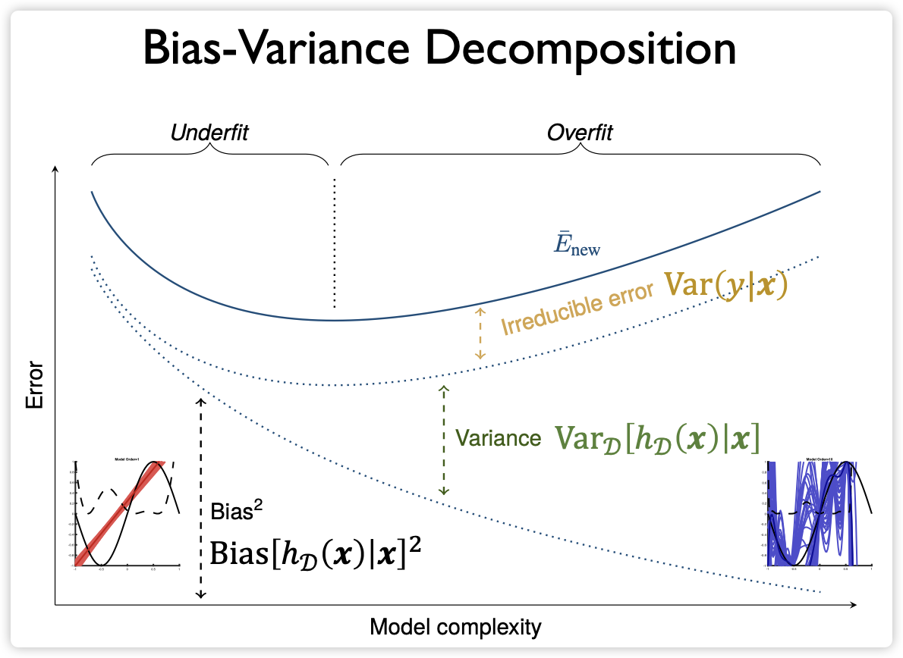

## 知识大纲

- **学习理论基础**
  - 学习 ≠ 拟合：泛化与记忆的区别
  - 期望误差 vs. 经验误差
  - 偏差-方差分解与近似-估计误差分解
- **PAC 学习框架**
  - Probably Approximately Correct 定义
  - PAC 可学习性条件
- **概率基础工具**
  - 马尔可夫不等式、切比雪夫不等式
  - 霍夫丁不等式与麦克迪亚米德不等式
- **有限假设空间的泛化界**
  - 单假设界与多假设界（并集界）
  - Occam 剃刀原则
- **无限假设空间的泛化界**
  - Rademacher 复杂度
  - Growth Function（增长函数）
  - Vapnik-Chervonenkis 维度（VC 维）
  - Sauer 引理
- **线性模型的泛化界**
  - 基于 VC 维的界
  - 基于 Rademacher 复杂度的界
  - 核方法下的推广

---

## 一、学习理论基础

### 1. 学习 ≠ 拟合

- **泛化**（Generalization）指模型在**未见数据**上的表现，而非对训练数据的记忆。
- **复杂模型**（如高阶多项式）可能在训练集上误差极低，但泛化能力差，即**过拟合**。
- 核心问题：如何在**模型复杂度**与**样本量**之间取得平衡，避免欠拟合或过拟合。

> 泛化不是记忆，而是对数据生成规律的捕捉。

### 2. 期望误差与经验误差

设数据分布为 $\mathcal{D}$，损失函数为 $\ell$，假设 $h: \mathcal{X} \to \mathcal{Y}$：

- **期望误差**（Expected Error）：
  $$
  \mathcal{E}(h) = \mathbb{E}_{(x,y) \sim \mathcal{D}}[\ell(h(x), y)]
  $$
- **经验误差**（Empirical Error）在训练集 $\mathcal{D}_n = \{(x_i, y_i)\}_{i=1}^n$ 上为：
  $$
  \widehat{\mathcal{E}}_{\mathcal{D}_n}(h) = \frac{1}{n} \sum_{i=1}^n \ell(h(x_i), y_i)
  $$

> 目标是最小化 $\mathcal{E}(h)$，但只能通过 $\widehat{\mathcal{E}}_{\mathcal{D}_n}(h)$ 进行优化。
> $\widehat{\mathcal{E}}_{\mathcal{D}_n}(h)$ 是 $\mathcal{E}(h)$ 的无偏估计。

### 3. 偏差-方差分解（回归情形）

对 L2 损失，期望误差可分解为：
$$
\mathbb{E}_{(x,y), \mathcal{D}_n}[(h_{\mathcal{D}_n}(x) - y)^2] = \underbrace{\text{Var}[y|x]}_{\text{Bayes Error}} + \underbrace{(\mathbb{E}_{\mathcal{D}_n}[h_{\mathcal{D}_n}(x)] - f^*(x))^2}_{\text{Bias}^2} + \underbrace{\text{Var}_{\mathcal{D}_n}[h_{\mathcal{D}_n}(x)]}_{\text{Variance}}
$$
其中 $f^*(x) = \mathbb{E}[y|x]$ 为真实回归函数。

### 4. 估计误差 vs. 逼近误差

对任意假设 $h \in \mathcal{H}$，有：
$$
\mathcal{E}(h) - \mathcal{E}^* = \underbrace{[\mathcal{E}(h) - \mathcal{E}(h^*)]}_{\text{Estimation Error}} + \underbrace{[\mathcal{E}(h^*) - \mathcal{E}^*]}_{\text{Approximation Error}}
$$
其中 $h^* = \arg\min_{h \in \mathcal{H}} \mathcal{E}(h)$，$\mathcal{E}^* = \min_{\text{all } h} \mathcal{E}(h)$。

> **估计误差**是学习算法可控部分，也是泛化界关注的核心。

---

## 二、PAC 学习框架

### 1. PAC 定义

- **PAC**（Probably Approximately Correct）学习：对任意 $\epsilon > 0$、$\delta > 0$，存在学习算法 $\mathcal{A}$ 和多项式函数 $\text{poly}(1/\epsilon, 1/\delta, \cdot)$，使得当样本量 $n \geq \text{poly}(1/\epsilon, 1/\delta, \cdot)$ 时，
  $$
  \Pr_{\mathcal{D}_n \sim \mathcal{D}^n}\left[ \mathcal{E}(h_{\mathcal{D}_n}) - \min_{h \in \mathcal{H}} \mathcal{E}(h) \geq \epsilon \right] \leq \delta
  $$
  成立。

### 2. PAC 可学习性

- 若假设空间 $\mathcal{H}$ 有限，则 $\mathcal{H}$ 是 PAC 可学习的。
- 证明关键：通过泛化界控制估计误差。

---

## 三、概率基础工具

### 1. 马尔可夫不等式

若 $Z \geq 0$，则对任意 $a > 0$：
$$
\Pr[Z \geq a] \leq \frac{\mathbb{E}[Z]}{a}
$$

### 2. 切比雪夫不等式

对任意随机变量 $Z$ 与 $a > 0$：
$$
\Pr[|Z - \mathbb{E}[Z]| \geq a] \leq \frac{\text{Var}(Z)}{a^2}
$$

### 3. 霍夫丁不等式（Hoeffding’s Inequality）

设 $Z_1, \dots, Z_n$ 独立，且 $Z_i \in [a_i, b_i]$，则对任意 $t > 0$：
$$
\Pr\left[ \sum_{i=1}^n (Z_i - \mathbb{E}[Z_i]) \geq t \right] \leq \exp\left( -\frac{2t^2}{\sum_{i=1}^n (b_i - a_i)^2} \right)
$$

### 4. 麦克迪亚米德不等式（McDiarmid’s Inequality）

设 $f(x_1, \dots, x_n)$ 满足：对任意 $i$，改变 $x_i$ 时函数值变化不超过 $c_i$，则：
$$
\Pr\left[ f - \mathbb{E}[f] \geq t \right] \leq \exp\left( -\frac{2t^2}{\sum_{i=1}^n c_i^2} \right)
$$

> 麦克迪亚米德是霍夫丁的推广，适用于更一般的函数。

---

## 四、有限假设空间的泛化界

### 1. 单假设界

对固定 $h$，若 $\ell \in [0,1]$，则对任意 $\delta > 0$，以概率 $\geq 1 - \delta$：
$$
\mathcal{E}(h) \leq \widehat{\mathcal{E}}_{\mathcal{D}_n}(h) + \sqrt{\frac{\log(2/\delta)}{2n}}
$$

### 2. 多假设界（并集界）

对有限假设空间 $|\mathcal{H}| < \infty$，以概率 $\geq 1 - \delta$，对所有 $h \in \mathcal{H}$：
$$
\mathcal{E}(h) \leq \widehat{\mathcal{E}}_{\mathcal{D}_n}(h) + \sqrt{\frac{\log|\mathcal{H}| + \log(2/\delta)}{2n}}
$$

> 此即 **Occam 剃刀**的理论体现：假设空间越小（$\log|\mathcal{H}|$ 越小），泛化界越紧。

---

## 五、无限假设空间的泛化界

### 1. Rademacher 复杂度

- **Rademacher 变量**：$\sigma_i$ 独立同分布，$\Pr[\sigma_i = 1] = \Pr[\sigma_i = -1] = 1/2$。
- **经验 Rademacher 复杂度**（对函数类 $\mathcal{F}$）：
  $$
  \widehat{\mathfrak{R}}_{\mathcal{D}_n}(\mathcal{F}) = \mathbb{E}_{\sigma}\left[ \sup_{f \in \mathcal{F}} \frac{1}{n} \sum_{i=1}^n \sigma_i f(z_i) \right]
  $$
- **期望 Rademacher 复杂度**：
  $$
  \mathfrak{R}_n(\mathcal{F}) = \mathbb{E}_{\mathcal{D}_n}[\widehat{\mathfrak{R}}_{\mathcal{D}_n}(\mathcal{F})]
  $$

#### 泛化界（Rademacher 形式）

对 $\mathcal{F} \subseteq [0,1]^\mathcal{Z}$，以概率 $\geq 1 - \delta$，对所有 $f \in \mathcal{F}$：
$$
\mathbb{E}[f] \leq \frac{1}{n} \sum_{i=1}^n f(z_i) + 2\mathfrak{R}_n(\mathcal{F}) + \sqrt{\frac{\log(1/\delta)}{2n}}
$$
或使用经验复杂度：
$$
\mathbb{E}[f] \leq \frac{1}{n} \sum_{i=1}^n f(z_i) + 2\widehat{\mathfrak{R}}_{\mathcal{D}_n}(\mathcal{F}) + 3\sqrt{\frac{\log(2/\delta)}{2n}}
$$

### 2. Growth Function（增长函数）

- 定义：$\Pi_{\mathcal{H}}(n) = \max_{x_1,\dots,x_n} |\{ (h(x_1), \dots, h(x_n)) : h \in \mathcal{H} \}|$
- 表示 $n$ 个点最多能被 $\mathcal{H}$ 分成多少种标签组合。
- 若 $\Pi_{\mathcal{H}}(n) = 2^n$，称 $\mathcal{H}$ **打散**（shatter）该点集。

### 3. VC 维度（Vapnik-Chervonenkis Dimension）

- 定义：
  $$
  \text{VCdim}(\mathcal{H}) = \max \{ n : \Pi_{\mathcal{H}}(n) = 2^n \}
  $$
- 示例：
  - 实数轴上区间分类器：$\text{VCdim} = 2$
  - $\mathbb{R}^d$ 中超平面：$\text{VCdim} = d + 1$
  - 正弦函数分类器：$\text{VCdim} = \infty$

### 4. Sauer 引理

若 $\text{VCdim}(\mathcal{H}) = d < \infty$，则对所有 $n$：
$$
\Pi_{\mathcal{H}}(n) \leq \sum_{i=0}^d \binom{n}{i} \leq \left( \frac{en}{d} \right)^d
$$

### 5. VC 泛化界

对二分类 $\mathcal{H} \subseteq \{-1,+1\}^\mathcal{X}$，若 $\text{VCdim}(\mathcal{H}) = d$，则以概率 $\geq 1 - \delta$，对所有 $h \in \mathcal{H}$：
$$
\mathcal{E}(h) \leq \widehat{\mathcal{E}}_{\mathcal{D}_n}(h) + \sqrt{ \frac{2d \log(en/d) + \log(2/\delta)}{2n} }
$$

> 当 $d \gg n$ 时，此界无意义，说明 VC 界是**分布无关**的，可能过于保守。

---

## 六、线性模型的泛化界

### 1. 基于 VC 维的界

- 超平面在 $\mathbb{R}^d$ 中 VC 维为 $d+1$，代入上式即得界。
- 缺点：高维（如 $d > n$）时界失效，但实践中线性模型仍有效。

### 2. 基于 Rademacher 复杂度的界

设输入有界 $\|x\| \leq B$，权重有界 $\|w\| \leq \Lambda$，则线性函数类 $\mathcal{H} = \{ x \mapsto w^\top x \}$ 满足：
$$
\widehat{\mathfrak{R}}_{\mathcal{D}_n}(\mathcal{H}) \leq \frac{B \Lambda}{\sqrt{n}}
$$

#### 泛化界（线性模型）

以概率 $\geq 1 - \delta$，对所有 $h \in \mathcal{H}$：
$$
\mathcal{E}(h) \leq \widehat{\mathcal{E}}_{\mathcal{D}_n}(h) + \frac{B \Lambda}{\sqrt{n}} + 3\sqrt{\frac{\log(2/\delta)}{2n}}
$$

> 此界在 $d \gg n$ 时仍有效，且依赖数据分布（通过 $B$），更实用。

### 3. 核方法下的推广

设核函数 $K(x, x') = \langle \phi(x), \phi(x') \rangle$，且 $K(x, x) \leq B^2$，权重 $\|w\|_{\mathcal{H}} \leq \Lambda$，则：
$$
\widehat{\mathfrak{R}}_{\mathcal{D}_n}(\mathcal{H}) \leq \Lambda \sqrt{ \frac{ \text{Tr}(K) }{n} } \leq \frac{B \Lambda}{\sqrt{n}}
$$
其中 $K$ 为核矩阵。

---

## 本章要点

- **泛化**是学习的核心目标，需区分**经验误差**与**期望误差**。
- **PAC 框架**为学习算法提供理论保证：以高概率接近最优。
- **有限假设空间**的泛化界由 $\log|\mathcal{H}|$ 控制，体现 Occam 剃刀。
- **无限假设空间**需用复杂度度量：**Rademacher 复杂度**、**增长函数**、**VC 维**。
- **VC 维**是组合度量，给出分布无关界；**Rademacher 复杂度**更精细，适用于高维和核方法。
- **线性模型**在权重和输入有界时，泛化误差以 $O(1/\sqrt{n})$ 速率收敛。
- 理论界虽保守，但揭示了**模型复杂度**、**样本量**与**泛化能力**的根本关系。
