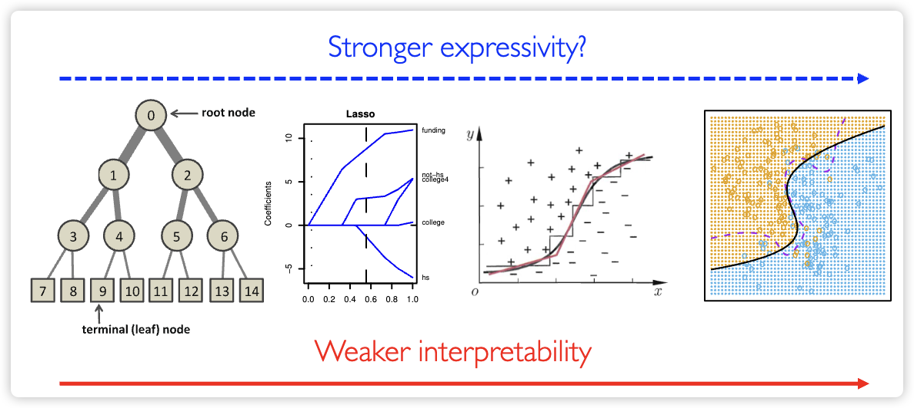

## 课程概览

本讲系统讲解了**决策树**（Decision Tree）这一基础且重要的机器学习模型。内容涵盖从基本思想、构建算法（ID3、C4.5、CART）、处理连续/缺失值、防止过拟合的剪枝策略，到其泛化能力的理论边界；并进一步拓展至**集成方法**，重点介绍了**Bagging**与**随机森林**（Random Forest）的原理、优势与实现机制。

## 知识大纲

- **决策树基础**
  - 人类分类器类比
  - 节点纯度与分裂准则
  - 信息增益（Information Gain）
- **经典决策树算法**
  - ID3 算法
  - C4.5 算法（处理多值、连续值、缺失值、代价、剪枝）
  - 分类与回归树（CART）
- **理论分析**
  - 泛化边界（VC维与最小描述长度界）
- **集成学习：随机森林**
  - Bootstrap 与 Bagging
  - Out-of-Bag (OOB) 验证
  - Breiman 随机森林算法
- **模型特性与权衡**
  - 优缺点分析
  - 偏差-方差分解

---

## 一、决策树基础

### 1. **基本思想与人类分类器类比**

决策树模拟人类的决策过程，通过一系列**if-else**规则对特征空间进行递归划分。每个**内部节点**测试一个属性，每个**分支**对应一个属性值，每个**叶节点**给出一个分类（或回归值）。其最大的优势在于**可解释性强**。

> 在测试时，可以清晰地追溯决策路径，回答“为什么做出这个预测？”的问题。

### 2. **节点分裂准则：纯度度量**

决策树的目标是构建**纯度高**的叶节点（即节点内样本尽可能属于同一类别）。为此，需定义**节点不纯度**（Impurity）度量，并选择能最大程度降低不纯度的特征进行分裂。

常用的不纯度度量有三种：

- **分类错误率**（Misclassification Error）:
  $$ \text{Err}(t) = 1 - \max_{k} p(t, k) $$
- **熵**（Entropy）:
  $$ H(t) = -\sum_{k} p(t, k) \log p(t, k) $$
- **基尼指数**（Gini Index）:
  $$ \text{Gini}(t) = 1 - \sum_{k} p(t, k)^2 $$

其中 $p(t, k)$ 是节点 $t$ 中属于类别 $k$ 的样本比例。这三种度量在实践中效果相似，但熵和基尼指数更常用，因为它们对节点内概率变化更敏感。

### 3. **信息增益**（Information Gain, IG）

**信息增益**是衡量一次分裂效果的指标，定义为父节点的熵与子节点加权平均熵之差。它代表了通过分裂减少的不确定性。

- 父节点熵: $H(T)$
- 子节点加权平均熵: $\frac{|T_L|}{|T|}H(T_L) + \frac{|T_R|}{|T|}H(T_R)$
- **信息增益**:
  $$ IG(T, a) = H(T) - \left( \frac{|T_L|}{|T|}H(T_L) + \frac{|T_R|}{|T|}H(T_R) \right) $$

ID3 算法在每个节点选择使 **IG** 最大的特征进行分裂。

---

## 二、经典决策树算法

### 1. **ID3 算法**

- **核心**：使用**信息增益**（IG）作为分裂准则。
- **流程**：
  1. 创建根节点，包含所有训练样本。
  2. 若所有样本属于同一类，则将该节点标记为叶节点并返回。
  3. 否则，计算所有特征的信息增益，选择 **IG** 最大的特征 $a$。
  4. 为 $a$ 的每个可能取值创建一个子节点，并将对应样本分配到子节点。
  5. 对每个非纯子节点递归执行步骤2-4。
- **局限**：
  - 仅适用于**离散特征**。
  - **倾向于选择取值多的特征**（因为这类特征容易产生纯度很高的子节点，导致IG虚高）。
  - **容易过拟合**，缺乏剪枝机制。

### 2. **C4.5 算法**

C4.5 是 ID3 的改进版，解决了其多个关键缺陷。

#### 1）**增益率**（Gain Ratio）

为克服ID3对多值特征的偏好，C4.5 引入**增益率**（GR）：
$$ \text{GR}(T, a) = \frac{IG(T, a)}{IV(a)} $$
其中 $IV(a)$ 是**内在价值**（Intrinsic Value），即特征 $a$ 自身取值的熵：
$$ IV(a) = -\sum_{v \in \text{values}(a)} \frac{|T_v|}{|T|} \log \frac{|T_v|}{|T|} $$
增益率通过惩罚取值多的特征，使得分裂准则更加公平。

#### 2）**处理连续值特征**

对于连续特征 $x$，C4.5 通过**二分法**寻找最佳分割点 $t$：

- 将样本按 $x$ 排序。
- 在每对相邻样本值之间尝试分割点（通常取中点）。
- 计算每个候选分割点的信息增益（或增益率）。
- 选择使增益最大的分割点，将特征转化为 **$x \leq t$** 或 **$x > t$** 的二元测试。

#### 3）**处理缺失值**

- **训练时**：
  - **计算增益**：在计算某特征的增益时，只使用在该特征上没有缺失值的样本子集，最后将计算出的增益乘以一个权重（即非缺失样本占总样本的比例）。
  - **分配样本**：在将样本分配到子节点时，对于缺失该特征的样本，**按权重**将其分配到所有子节点中。权重为各个子节点所含非缺失样本的比例。
- **测试时**：当测试样本在某个特征上缺失时，可以将其**按权重**送入所有子分支，最终结果是所有分支预测值的加权平均。

#### 4）**剪枝**（Pruning）

剪枝是解决决策树**过拟合**的关键技术。

- **预剪枝**（Pre-pruning）：在构建树的过程中，如果一个节点的分裂**不能带来泛化性能的提升**（例如，在验证集上准确率下降），则**提前停止**分裂，将其标记为叶节点。
  - **优点**：高效，生成的树更小。
  - **缺点**：可能导致**欠拟合**，因为某个分裂看似无益，但其后续分裂可能很有价值（“短视”问题）。

- **后剪枝**（Post-pruning）：先构建一棵完整的树，然后自底向上地考察每个非叶节点。如果将该节点对应的子树替换为一个叶节点能**提升泛化性能**，则执行剪枝。C4.5 采用的即是此策略。
  - **优点**：效果通常优于预剪枝，不易欠拟合。
  - **缺点**：计算开销大，因为需要先生成完整的树。

#### 5）**考虑特征代价**

在某些场景下（如医疗诊断），获取不同特征的代价不同。C4.5 可以通过修改分裂准则（如 $GR/\text{Cost}$）来优先选择**代价低且信息量高**的特征。

#### 6）**树复杂度正则化** (Tree Complexity Regularization)

除了剪枝，还可以通过在优化目标中加入**正则化项**来控制树的复杂度，这是一种更形式化的方法，旨在平衡模型的**经验风险**（对训练数据的拟合度）和**结构风险**（模型自身的复杂度）。

- **目标函数**:
  $$ C_\alpha(T) = \text{Err}(T) + \alpha \cdot |\text{Leaves}| $$
  其中：
  - $\text{Err}(T)$ 是树 $T$ 在训练集上的误差。
  - $|\text{Leaves}|$ 是树 $T$ 的叶节点数量，代表了模型的复杂度。
  - $\alpha$ 是一个正则化参数，用于权衡拟合度与复杂度。$\alpha$ 越大，模型越倾向于选择更小的树。

- **应用**: 这种方法被称为**代价复杂度剪枝**（Cost-Complexity Pruning），是 CART 算法中使用的核心剪枝策略。通过逐步增加 $\alpha$，可以得到一系列嵌套的最优子树，最终通过交叉验证选择最佳的树。

#### 7）**理解决策树** (Understanding Decision Trees)

决策树模型的核心优势在于其高度的可解释性，我们可以从两个层面来理解它：

- **规则集**: 从根节点到每个叶节点的路径都可以看作是一条**if-then规则**。整个决策树就是这些规则的集合，它们互斥且完备地覆盖了整个特征空间。
- **特征空间划分**: 决策树的构建过程等价于对特征空间进行递归的、与坐标轴平行的划分。每个内部节点的分裂都在某个维度上“切一刀”，将当前区域划分为两个或多个子区域，直到每个子区域都足够“纯净”。

#### 8）**表达能力 vs. 可解释性** (Expressivity vs. Interpretability)



### 3. **分类与回归树**（CART）

CART 是一种通用的二叉树模型，可同时用于分类和回归任务。

- **分类树**：使用**基尼指数**（Gini Index）作为分裂准则。每次分裂都是二元的（是/否）。
- **回归树**：
  - **目标**：预测连续值。
  - **叶节点值**：该节点内所有样本目标值的**均值**。
  - **分裂准则**：选择特征和分割点，使得分割后左右子节点的**平方误差和**（L2 loss）最小。
    $$ \min_{j, s} \left[ \min_{c_1} \sum_{x_i \in R_1(j,s)} (y_i - c_1)^2 + \min_{c_2} \sum_{x_i \in R_2(j,s)} (y_i - c_2)^2 \right] $$
    其中 $R_1, R_2$ 是由特征 $j$ 和分割点 $s$ 划分的两个区域，最优的 $c_1, c_2$ 即为各自区域的均值。

---

## 三、理论分析

### 1. **奥卡姆剃刀原则**

决策树的构建可以看作是寻找一个与训练数据一致且尽可能简单的假设。**奥卡姆剃刀原则**指出：“如无必要，勿增实体”，即我们应偏好更简单的模型。一个更小的决策树（节点更少）通常具有更好的泛化能力。这为剪枝和选择小树提供了哲学依据。

### 2. **泛化边界**

决策树的泛化能力可以通过理论边界进行分析。

- **VC维界**：一个具有 $p$ 个叶节点的决策树，其VC维为 $p$。对于输入为 $d$ 维的问题，完全生长的树VC维可高达 $2^d$，表明其**表示能力极强但也极易过拟合**。
- **最小描述长度**（MDL）：该理论认为，一个好的模型应该在拟合数据的同时，其自身的**描述长度**（即模型复杂度）要尽可能短。对于有 $L$ 个节点的决策树，其泛化误差上界包含一项与 $L \log(d+3)$ 相关的惩罚项，这为**偏好小树**提供了理论依据。

---

## 四、集成学习：随机森林

### 1. **Bootstrap 与 Bagging**

- **Bootstrap**（自助法）：从原始训练集（大小为 $n$）中**有放回**地随机抽取 $n$ 个样本，构成一个新的训练集。平均而言，约有 **63.2%** 的原始样本会被选中，其余 **37%** 的样本未被选中，称为**袋外**（Out-of-Bag, OOB）样本。
- **Bagging**（Bootstrap Aggregating）：通过 Bootstrap 生成多个不同的训练集，分别训练出多个基学习器（如决策树），最终预测时对分类任务采用**投票**，对回归任务采用**平均**。Bagging 的核心思想是通过**降低模型方差**来提升泛化性能。

### 2. **Out-of-Bag**(OOB)

OOB 样本可以天然地用作**验证集**。对于每个训练样本，可以用所有**未包含该样本**的基学习器对其进行预测，得到的 OOB 预测结果可以用来估计模型的**泛化误差**，而无需单独划分验证集。

### 3. **Breiman 随机森林算法**

随机森林是 Bagging 思想的强力扩展，由 Leo Breiman 提出。

- **核心思想**：在 Bagging 的基础上，**在每个节点分裂时，不是从所有特征中选择最优特征，而是从一个随机选取的特征子集**（大小为 $m$）。
- **伪代码**：
  1. 对 $b = 1$ 到 $B$（树的总数）：
      a.  从原始训练集进行 Bootstrap 采样，得到 $D_b$。
      b.  在 $D_b$ 上训练一棵决策树 $T_b$：
          - 在每个节点，随机选择 $m$ 个特征（$m \ll$ 总特征数）。
          - 在这 $m$ 个特征中，选择最优分裂特征和分割点。
          - 通常树会长得**很深**（甚至不剪枝）。
  2. 最终预测：对分类任务，集合所有 $T_b$ 的预测结果，进行**多数投票**。

- **特征重要性**：随机森林可以评估特征的重要性。一种常用方法是，对于每个特征，通过计算在所有树的 OOB 样本上，**随机打乱该特征值前后模型准确率的下降程度**来衡量其重要性。准确率下降越多，说明该特征越重要。

- **优势**：
  - 强大的**抗过拟合**能力。
  - 能有效处理高维数据和特征间的非线性关系。
  - 提供**OOB误差**作为无偏的性能估计。
  - Python `sklearn` 库提供了便捷的实现。

````python
from sklearn.ensemble import RandomForestClassifier
clf = RandomForestClassifier(
    n_estimators=100,    # 树的数量
    criterion="gini",    # 分裂准则
    max_depth=2,         # 最大深度
    random_state=0
)
clf.fit(X, y)
````

---

## 五、模型特性与权衡

### 1. **优点与缺点**

| 特性 | 描述 |
| :--- | :--- |
| **优点** | |
| 可解释性强 | 决策路径清晰，易于理解和可视化。 |
| 数据预处理少 | 不需要进行特征归一化或标准化。 |
| 自动特征选择 | 模型构建过程本身就是一种特征选择。 |
| 处理混合数据 | 能同时处理离散和连续型特征。 |
| 非线性建模 | 能有效捕捉复杂的非线性关系。 |
| **缺点** | |
| 容易过拟合 | 单棵决策树容易在训练数据上过度拟合，需要剪枝或集成。 |
| 不稳定性 | 训练数据的微小变动可能导致生成完全不同的树。 |
| 局部最优 | 采用贪心算法构建，只能保证局部最优，而非全局最优。 |
| 偏好高基数特征 | 信息增益等准则天然偏好取值多的特征（C4.5的增益率可缓解）。 |
| 轴平行边界 | 单棵树的决策边界与坐标轴平行，难以处理斜向关系。 |

### 2. **偏差-方差分解**

- **单棵决策树**：通常是**低偏差、高方差**的模型。它能很好地拟合训练数据（低偏差），但对新数据不稳定（高方差）。
- **Bagging/随机森林**：通过对多棵树的结果进行平均/投票，能够显著**降低模型的方差**，同时保持较低的偏差，从而提高整体的泛化性能。

---

## 本章要点

- **决策树**通过递归分割特征空间进行预测，**可解释性强**。
- **ID3** 使用**信息增益**（IG），但易受多值特征影响。
- **C4.5** 通过**增益率**（GR）、**连续值处理**、**缺失值处理**和**后剪枝**改进了 ID3。
- **CART** 使用**基尼指数**（分类）或**最小平方误差**（回归）作为分裂准则，且是**二叉树**。
- 决策树的泛化能力受其**复杂度**（叶节点数）影响，理论上有相应的**泛化边界**。
- **Bagging** 通过**Bootstrap采样**和**模型平均**来**降低方差**。
- **随机森林**在 Bagging 基础上增加了**特征随机性**，是实践中极为强大和稳健的算法。
- 决策树的主要弱点是**高方差**，而集成方法（如随机森林）是克服此问题的有效手段。
