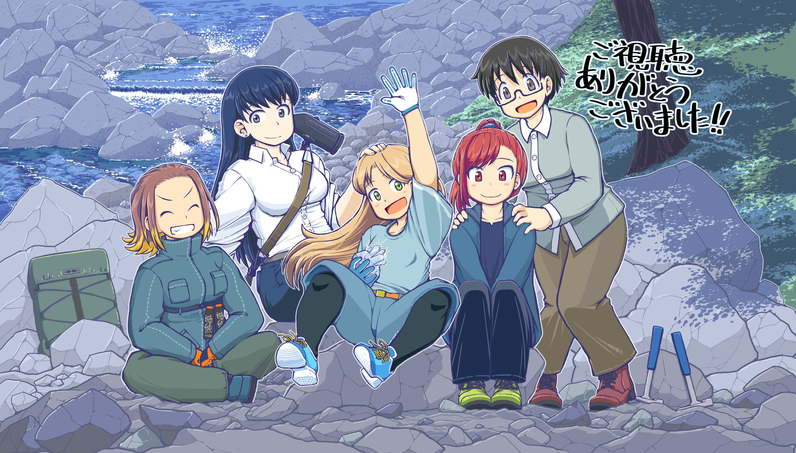
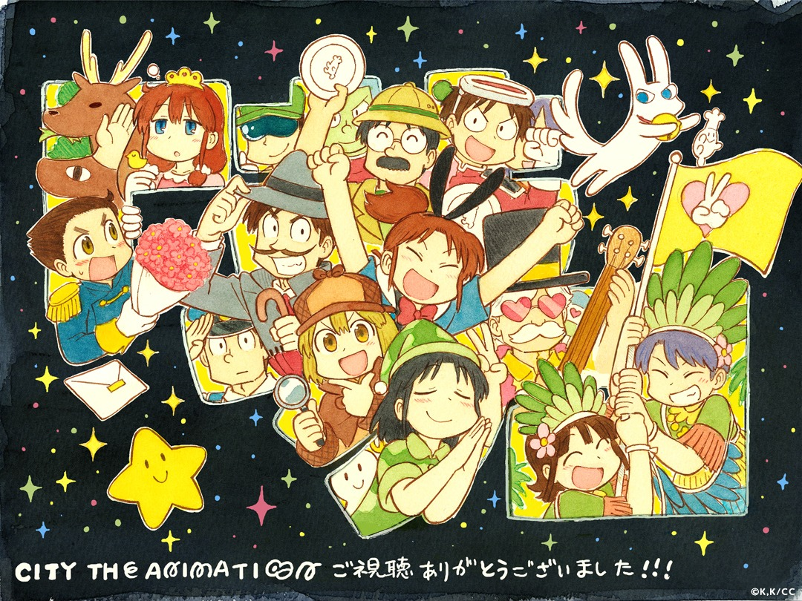
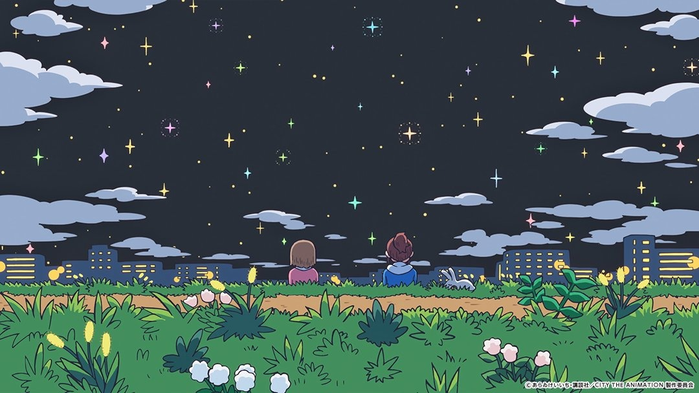
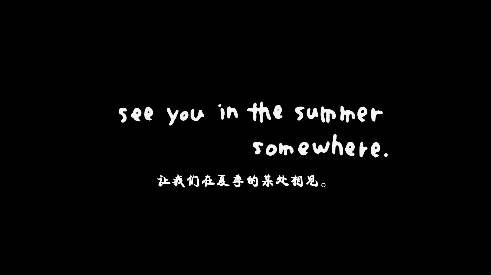

七月番完结有感：《我现在可能是世界上最空虚的人了》

---

## 我们不可能成为恋人！绝对不行。 (※似乎可行？)

**紫阳花天使daisuki！紫阳花天使daisuki！紫阳花天使daisuki！**

---

## 琉璃的宝石

**完结撒花🎉**
oinmai精神续作，从故事到制作都充满了生命和活力。
随时都能打开看一集、会想要安利给朋友的好动画。
*官方tv片尾插图：涩谷圭一郎*

> 制作：美！ 本片制作本对女性身体和动作的描绘，对石头的光泽的表现，而光影尤其是夕阳的表现更是无敌。 故事：浪漫！成百上万年的积攒只为一个偶遇这是浪漫，在死板的实验、重复的验证里能够找到属于自己意义这也是浪漫。这2种浪漫这里都有如此浪漫的作品怎能让人不心动。
>
> - credit to @leleq(bangumi)

---

## 小城日常

**纯主观：** 感动，不必多说，还是那个熟悉的京阿尼。
*官方完结贺图*

*最终话截图x2*

> 真诚而富有生命力的作品。不同于同制作公司+原作者的《日常》的电波系搞笑，本作则更着重于如箱庭的小镇的人之间的温馨的连结，并不断抛出ep4/5/9/13等代表回，做到了表现手法即为主旨表达。而如今仍愿意抛出各种创意的京阿尼，则如许久未见的老朋友用本作开头op和最后一集分别向它的观众诉说：“Hello, Dear my friends！还记得我们曾经畅谈梦想的那些时光吗？” “愿你我永远年轻！” 恰如作品里小镇的人们度过了一个暑假，这也是我与京阿尼间的盛夏记忆。
>
> - credit to @潮留美海(bangumi)

---

## 拔作岛

从未如此美妙的开局！初看时给人一种很燃但不知道再燃什么的生草感。
后期的主线略显乏力，除了谐音梗黄段子和sex版的热血战斗番设定以外，没有其他新看点。
横向对比黄段子学生会，人物形象略显单一，nlns和fs的很多角色都没有展开；
对比异种族风俗娘，世界观设定略显粗糙。
总而言之，言而总之，nns可爱捏，郁子可爱捏。好看，适合一周一集慢慢看，但不会再看第二遍。

---

- *不是追完第一时间写的，就偷懒了*

---

## 不良少女

低配版摇曳百合，故事挺有乐子的，但是人设不是很对我的胃口。

---

## 新 吊带袜天使

是动画纯良了，还是我更混沌了🤔

---

## 彻夜之歌 第二季

氛围感拉满，略带忧郁和寂寞的浪漫午夜。

---

## 更衣人偶坠入爱河 第二季

充满生命力的人物无论干什么都闪闪反光。

---
